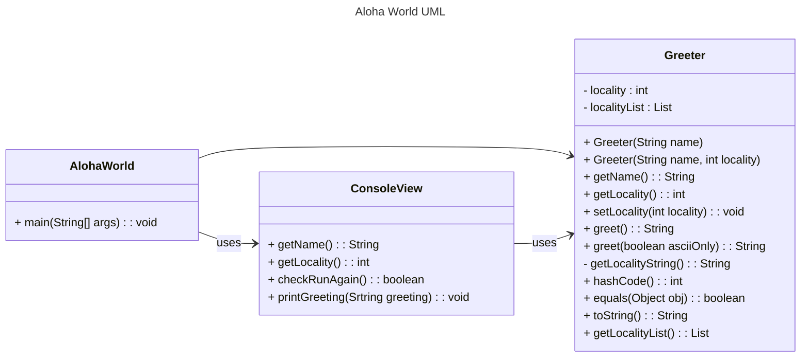

# Markdown Playground

> [!NOTE]
> [IntelliJ Mermaid Plugin](https://plugins.jetbrains.com/plugin/20146-mermaid). Also for intelliJ, this is often installed by default, but incase it isn't [Markdown Plugin IntelliJ](https://plugins.jetbrains.com/plugin/7793-markdown). 

> [!NOTE] 
> [VS Code Mermaid Preview](https://marketplace.visualstudio.com/items?itemName=bierner.markdown-mermaid). Markdown preview is enabled by default, but if you want the full github flavored markdown, [Github Styling Preview](https://marketplace.visualstudio.com/items?itemName=bierner.markdown-preview-github-styles) is popular. 


## Markdown Resources

* [Markdown Guide](https://www.markdownguide.org/basic-syntax/)
* [Github Flavored Markdown](https://guides.github.com/features/mastering-markdown/)
* [Github Markdown Getting Started](https://docs.github.com/en/get-started/writing-on-github/getting-started-with-writing-and-formatting-on-github/basic-writing-and-formatting-syntax)
* [Mermaid Syntax Reference](https://mermaid.js.org/intro/syntax-reference.html) 


<!-- start your playground code under this dashed line -->
----
3 different markdown elements I learned
   * `-->`:  indicating the source and destination of the relationship, showing which class uses or references the other
   * `(```Triple Backticks)`: used in Markdown to create code blocks
   * `direction LR`: set the direction of the diagram’s layout. Arranges elements from right to left.




<pre>

<pre>